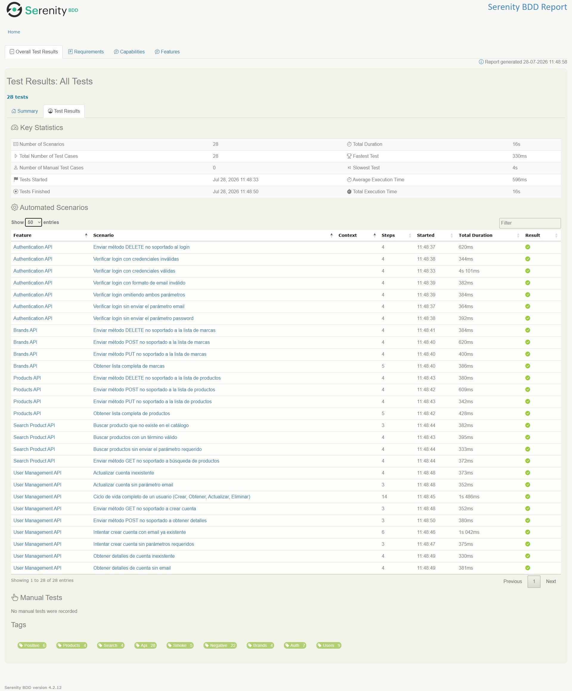
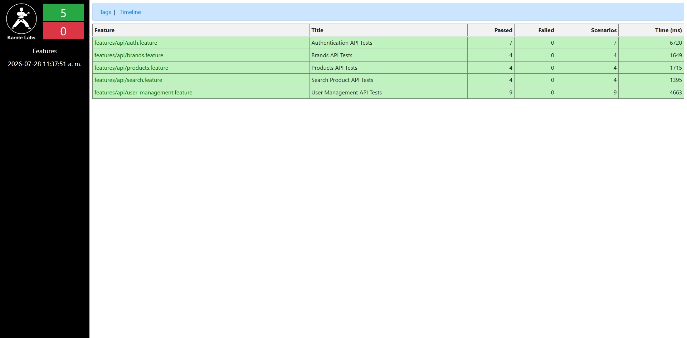
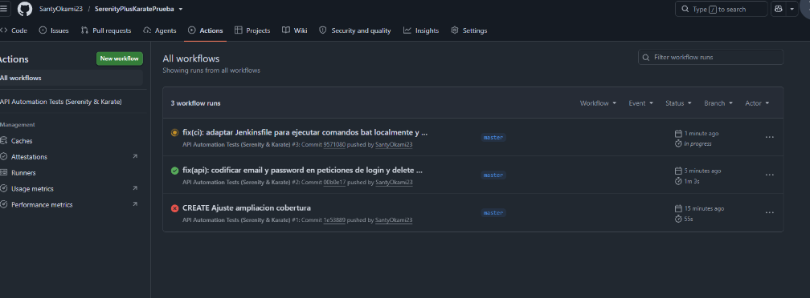
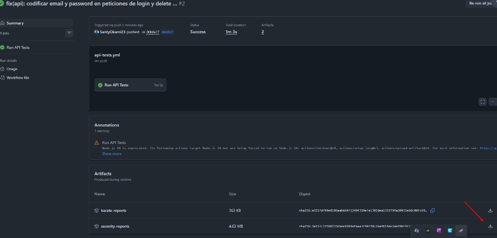
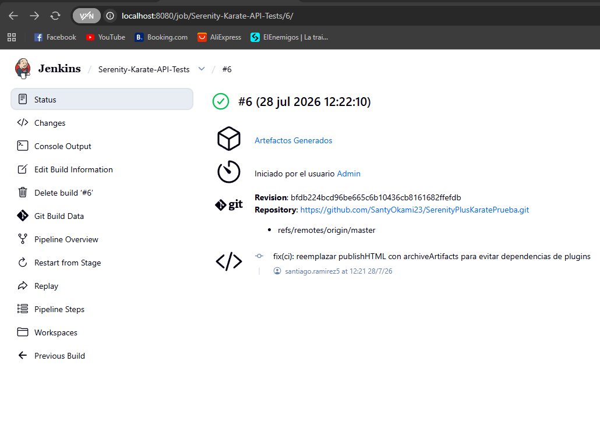

# Automation Exercise API Test Suite

Este repositorio contiene la automatización de la API de **AutomationExercise** (https://automationexercise.com/api_testing) utilizando un enfoque multi-módulo que integra dos potentes frameworks:

1. **Serenity BDD + REST Assured + Cucumber** (Arquitectura Screenplay)
2. **Karate DSL**

El proyecto ha sido diseñado siguiendo estándares estrictos de Clean Code, principios SOLID, y prácticas de mantenibilidad. Se ha implementado también configuración para Inteligencia Artificial mediante directivas en `.agents`.

## Arquitectura del Proyecto

El proyecto está estructurado con Maven Multi-Módulo:

```text
├── serenity-rest-module/   # Módulo Serenity + Cucumber (Screenplay)
├── karate-module/          # Módulo Karate DSL
├── .github/workflows/      # Pipelines de GitHub Actions
├── Jenkinsfile             # Pipeline de Jenkins
└── .agents/                # Reglas y Skills para asistentes de IA
```

## Requisitos Previos

- Java JDK 17 o superior.
- Apache Maven 3.8 o superior.
- Git.

## Configuración e Instalación

1. Clona este repositorio:
   ```bash
   git clone <url-del-repositorio>
   ```

2. Descarga las dependencias y compila:
   ```bash
   mvn clean install -DskipTests
   ```

## Ejecución de las Pruebas

Puedes ejecutar todo el proyecto (ambos módulos) o ejecutarlos independientemente.

### Ejecutar Todas las Suites
```bash
mvn clean verify
```

### Ejecutar Solo Serenity BDD
```bash
mvn clean verify -pl serenity-rest-module
```
Los reportes HTML detallados se generarán en: `serenity-rest-module/target/site/serenity/index.html`

### Ejecutar Solo Karate DSL
```bash
mvn clean test -pl karate-module
```
Los reportes de Karate se generarán en: `karate-module/target/karate-reports/karate-summary.html`

## Reportes de Pruebas (Evidencias)

A continuación se muestran evidencias de la correcta ejecución de todos los escenarios de prueba en ambos frameworks:

### Reporte de Serenity BDD


### Reporte de Karate DSL


## Documentación del Proyecto

Para entender a fondo la estrategia, configuración y directivas de este repositorio, te invitamos a leer los siguientes documentos clave:

### 1. Plan de Pruebas
- **[`docs/PLAN_DE_PRUEBAS.md`](docs/PLAN_DE_PRUEBAS.md)**: Contiene el alcance detallado, los objetivos, la estrategia de datos (DataFaker), la matriz de trazabilidad y la lista exhaustiva de todos los casos de prueba mapeados para las 14 APIs cubiertas. Es el documento base de calidad del proyecto.

### 2. Directivas de Inteligencia Artificial (Agents)
Este proyecto ha sido configurado para desarrollo asistido por IA (Antigravity/Gemini). Las directivas viven en `.agents/`:
- **[`.agents/AGENTS.md`](.agents/AGENTS.md)**: Define las reglas estrictas de negocio, arquitectura SOLID, Clean Code, estándares de nombrado, convenciones de *commits* y prohibición de anti-patrones.
- **[`.agents/skills/api-automation/SKILL.md`](.agents/skills/api-automation/SKILL.md)**: Brinda a la IA el contexto profundo sobre los frameworks (Serenity y Karate), para que actúe como Automation Engineer respetando el estilo del equipo.

### 3. Configuración de Integración Continua (CI/CD)
- **[`.github/workflows/api-tests.yml`](.github/workflows/api-tests.yml)**: Archivo YAML que define el pipeline automatizado en GitHub Actions (ejecuta tests y guarda artefactos tras cada push a la rama `master`).
- **[`Jenkinsfile`](Jenkinsfile)**: Script Groovy (Pipeline) preparado para ejecutar la suite completa en entornos locales y empresariales con Windows (`bat`), gestionando herramientas como `maven-3` y recolectando los reportes a través de *ArchiveArtifacts*.

## Integración Continua (CI/CD)

El proyecto está configurado para ejecutarse automáticamente en el flujo de CI/CD.

Cada vez que se hace un *push* a la rama `master`, **GitHub Actions** dispara automáticamente la ejecución de todas las pruebas (tanto de Serenity como de Karate). Una vez finalizadas, los reportes en formato HTML se empaquetan y se generan como artefactos descargables (Artifacts) directamente en la plataforma.

A continuación se muestran evidencias de las ejecuciones automáticas en GitHub Actions:


<br/>


### Ejecución Local en Jenkins

Además de GitHub Actions, el repositorio incluye un `Jenkinsfile` completo que permite la ejecución de todas las pruebas en una instancia local de Jenkins. Al finalizar el pipeline de manera exitosa, los reportes HTML de Serenity y Karate son comprimidos y guardados usando la funcionalidad nativa de *Artifacts* de Jenkins.


